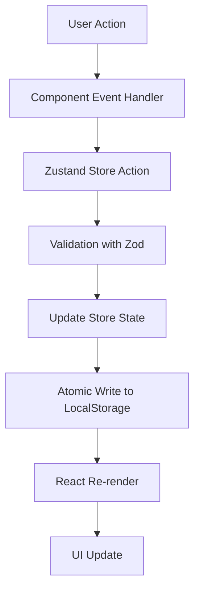

# Daily Todo

A modern, lightweight daily task management application built with React and TypeScript. Organize your tasks day by day with a clean, intuitive interface.


## ✨ Features

### Core Functionality
- ✅ **Daily Task Management**: Organize tasks by date with easy navigation
- ✏️ **CRUD Operations**: Add, edit, delete, and mark tasks as complete
- 💾 **Local Persistence**: All data stored securely in browser localStorage
- 📅 **Date-based Organization**: View tasks for any date (past, present, or future)
- 🔄 **Real-time Sync**: Instant updates across all operations

### Advanced Features
- 🔒 **Multi-tab Detection**: Automatic read-only mode when multiple tabs are open
- 🚀 **Performance Optimized**: Virtual scrolling for large task lists (100+ tasks)
- ⚡ **Code Splitting**: Lazy-loaded components for faster initial load
- ⌨️ **Keyboard Shortcuts**: Efficient navigation without mouse
- 📱 **Responsive Design**: Works seamlessly on desktop, tablet, and mobile
- 🎨 **Modern UI**: Clean Tailwind CSS design with smooth animations
- 🔔 **Toast Notifications**: Instant feedback for all operations
- 💪 **Error Recovery**: Graceful handling of storage corruption with export/reset options

### Data Safety
- 🔐 **Atomic Writes**: Transactional storage updates with automatic rollback
- ✅ **Schema Validation**: Zod-powered runtime validation
- 📤 **Export/Import**: Backup and restore your data anytime
- 🛡️ **Error Boundaries**: Prevents app crashes from rendering errors

---

## 🚀 Quick Start

### Prerequisites

- **Node.js**: v18.0.0 or higher
- **npm**: v9.0.0 or higher

### Installation

```bash
# Clone the repository
git clone <repository-url>
cd todo-app

# Install dependencies
npm install

# Start development server
npm run dev
```

The app will be available at `http://localhost:5173`

### Building for Production

```bash
# Create optimized production build
npm run build

# Preview production build locally
npm run preview
```

---

## 📖 User Guide

### Adding a Task

1. Type your task description in the input field
2. Press `Enter` or click "Add Task" button
3. Task appears in the "Pending" section

**Validation**:
- Minimum 1 character
- Maximum 500 characters
- Cannot be empty or whitespace only

### Completing a Task

1. Click the checkbox next to the task
2. Task moves to "Completed" section with strikethrough
3. Completion timestamp is recorded

**Toggle**: Click checkbox again to mark as incomplete

### Editing a Task

1. Hover over task to reveal action buttons
2. Click the **pencil icon** (Edit)
3. Modify the description in the dialog
4. Click "Save" to confirm changes

### Deleting a Task

1. Hover over task to reveal action buttons
2. Click the **trash icon** (Delete)
3. Confirm deletion in the dialog
4. Task is permanently removed

### Navigating Dates

**Date Picker**:
- Click on any date to view tasks for that day
- Current date is highlighted
- Dates with tasks show badge indicators

**Keyboard Navigation**:
- `←` Previous day
- `→` Next day (up to today)
- `T` Jump to today

### Exporting Data

**Method 1: Menu Export**
1. Click export button (if available)
2. JSON file downloads automatically

**Method 2: Keyboard Shortcut**
- Press `Ctrl+E` (Windows/Linux) or `Cmd+E` (Mac)

**Export Format**: JSON file with timestamp
- Filename: `todo-app-backup-2025-01-15T12:00:00.000Z.json`

### Importing Data

1. Manually load data via browser console (developer feature)
2. Paste JSON content into localStorage
3. Refresh page to load imported data

**Note**: Import validation ensures data integrity

### Resetting Data

⚠️ **Warning**: This permanently deletes all tasks!

1. Look for "Reset" button (appears in read-only mode or settings)
2. Confirm the deletion dialog
3. App reloads with clean state

---

## ⌨️ Keyboard Shortcuts

| Shortcut | Action |
|----------|--------|
| `N` | Focus task input field |
| `T` | Go to today's date |
| `←` | Navigate to previous day |
| `→` | Navigate to next day |
| `Esc` | Close open dialogs |
| `Ctrl+E` / `Cmd+E` | Export data |
| `Enter` | Submit task (when input focused) |

**Tips**:
- Shortcuts work globally (except when typing in input fields)
- Use `Esc` to quickly dismiss dialogs
- Combine arrow keys for fast date navigation

---

## 🛠️ Development

### Project Structure

```
todo-app/
├── src/
│   ├── components/       # React components
│   │   ├── DatePicker.tsx
│   │   ├── TaskForm.tsx
│   │   ├── TaskItem.tsx
│   │   ├── TaskList.tsx
│   │   ├── EditTaskDialog.tsx
│   │   ├── DeleteConfirmDialog.tsx
│   │   ├── ErrorBanner.tsx
│   │   ├── ErrorBoundary.tsx
│   │   └── EmptyState.tsx
│   ├── stores/           # Zustand state management
│   │   ├── taskStore.ts
│   │   ├── appStore.ts
│   │   └── preferencesStore.ts
│   ├── utils/            # Utility functions
│   │   ├── storage.ts    # LocalStorage operations
│   │   ├── tabLock.ts    # Multi-tab detection
│   │   ├── dateUtils.ts  # Date manipulation
│   │   └── validation.ts # Zod schemas
│   ├── hooks/            # Custom React hooks
│   │   └── useKeyboardShortcuts.ts
│   ├── types/            # TypeScript type definitions
│   │   └── index.ts
│   ├── styles/           # Global styles
│   │   └── globals.css
│   ├── App.tsx           # Main application component
│   └── main.tsx          # Application entry point
├── tests/
│   ├── unit/             # Unit tests (Vitest)
│   ├── integration/      # Integration tests
│   └── e2e/              # End-to-end tests (Playwright)
│       ├── happy-path.spec.ts
│       └── multi-tab.spec.ts
├── docs/
│   └── STORAGE_API.md    # LocalStorage API documentation
├── public/               # Static assets
├── playwright.config.ts  # Playwright configuration
├── vite.config.ts        # Vite configuration
├── tailwind.config.js    # Tailwind CSS configuration
└── tsconfig.json         # TypeScript configuration
```

### Tech Stack

**Frontend**:
- [React 18.2+](https://react.dev/) - UI library
- [TypeScript 5.3+](https://www.typescriptlang.org/) - Type safety
- [Vite 5.0+](https://vitejs.dev/) - Build tool and dev server
- [Tailwind CSS 3.4+](https://tailwindcss.com/) - Utility-first CSS

**State Management**:
- [Zustand 4.4+](https://zustand-demo.pmnd.rs/) - Lightweight state management
- [zustand/middleware](https://github.com/pmndrs/zustand) - Persist middleware

**UI Components**:
- [Headless UI 1.7+](https://headlessui.com/) - Accessible component primitives
- [@heroicons/react 2.1+](https://heroicons.com/) - Icon library
- [react-hot-toast 2.4+](https://react-hot-toast.com/) - Toast notifications

**Utilities**:
- [date-fns 3.0+](https://date-fns.org/) - Date manipulation
- [Zod 3.22+](https://zod.dev/) - Runtime schema validation
- [@tanstack/react-virtual](https://tanstack.com/virtual) - Virtual scrolling

**Testing**:
- [Vitest 1.0+](https://vitest.dev/) - Unit testing framework
- [@testing-library/react 14.1+](https://testing-library.com/) - Component testing
- [Playwright 1.40+](https://playwright.dev/) - E2E testing

### Scripts

```bash
# Development
npm run dev              # Start dev server (port 5173)
npm run build           # Build for production
npm run preview         # Preview production build

# Testing
npm run test            # Run unit tests (Vitest)
npm run test:ui         # Run tests with UI
npm run test:e2e        # Run E2E tests (Playwright)
npm run test:e2e:ui     # Run E2E tests with UI

# Code Quality
npm run lint            # Lint code with ESLint
npm run type-check      # Check TypeScript types
```

### Environment Setup

**Development Requirements**:
- Enable JavaScript in browser
- Allow localStorage (required for data persistence)
- Modern browser (Chrome 90+, Firefox 88+, Safari 14+, Edge 90+)

**Optional Tools**:
- [React DevTools](https://react.dev/learn/react-developer-tools)
- [Redux DevTools](https://github.com/reduxjs/redux-devtools) (for Zustand debugging)

---

## 🧪 Testing

### Running Tests

**Unit Tests** (Vitest):
```bash
# Run all unit tests
npm run test

# Run tests in watch mode
npm run test -- --watch

# Run tests with coverage
npm run test -- --coverage

# Run specific test file
npm run test src/utils/storage.test.ts
```

**E2E Tests** (Playwright):
```bash
# Install Playwright browsers (first time only)
npx playwright install

# Run all E2E tests
npm run test:e2e

# Run E2E tests in UI mode
npm run test:e2e:ui

# Run specific test file
npx playwright test tests/e2e/happy-path.spec.ts

# Run tests in headed mode (see browser)
npx playwright test --headed
```

### Test Coverage

**Unit Tests**:
- ✅ Storage operations (read, write, validation)
- ✅ Date utilities (formatting, relative time)
- ✅ Tab lock mechanism
- ✅ Store actions (add, update, delete, toggle)
- ✅ Schema validation

**Integration Tests**:
- ✅ Component interactions
- ✅ Store updates trigger UI changes
- ✅ Form submissions
- ✅ Dialog workflows

**E2E Tests**:
- ✅ Happy path: add → complete → persist → reload
- ✅ Multi-tab detection and read-only mode
- ✅ Edit and delete workflows
- ✅ Date navigation
- ✅ Storage corruption recovery
- ✅ Export functionality

---

## 🏗️ Architecture

### State Management

The app uses **Zustand** with three separate stores:

**1. Task Store** (`taskStore.ts`):
- Manages all task CRUD operations
- Handles task persistence to localStorage
- Provides filtered task views by date

**2. App Store** (`appStore.ts`):
- Manages global app state (selected date, read-only mode)
- Handles tab locking and multi-tab detection
- Controls initialization flow

**3. Preferences Store** (`preferencesStore.ts`):
- Manages user preferences (last viewed date)
- Persists preferences separately from task data

### Data Flow



### Storage Architecture

**Atomic Transaction Pattern**:
1. Read current data from localStorage
2. Validate with Zod schema
3. Create backup of current data
4. Apply updates
5. Write to localStorage
6. On failure: rollback to backup

**Multi-Tab Safety**:
1. Tab acquires lock on mount
2. Updates heartbeat every 5 seconds
3. Other tabs detect lock and enter read-only mode
4. Lock released on tab close/hide
5. Stale locks (30+ seconds) are automatically expired

### Performance Optimizations

**1. Virtual Scrolling**:
- Activates at 50+ tasks
- Renders only visible items
- Smooth scrolling with overscan buffer

**2. Code Splitting**:
- Dialog components lazy-loaded
- Reduces initial bundle size
- Faster first paint

**3. React Optimizations**:
- `React.memo()` on TaskItem component
- `useRef` for input focus management
- Efficient re-render prevention

**4. Build Optimizations**:
- Vite's fast HMR (Hot Module Replacement)
- Tree-shaking for smaller bundle
- CSS purging with Tailwind

---

## 🔒 Security & Privacy

### Data Privacy

- ✅ **100% Local**: All data stored in browser localStorage
- ✅ **No Server**: Zero external API calls or tracking
- ✅ **No Analytics**: No usage data collection
- ✅ **Offline-First**: Works without internet connection

### Security Measures

**XSS Protection**:
- React's built-in XSS protection (auto-escaping)
- No `dangerouslySetInnerHTML` usage
- Input sanitization via validation

**Data Validation**:
- Runtime schema validation with Zod
- Type safety with TypeScript
- Input length limits (1-500 chars)

**Storage Safety**:
- Atomic write operations
- Automatic rollback on errors
- Corruption detection and recovery

### Limitations

⚠️ **Important**: localStorage is NOT encrypted
- Do not store sensitive information
- Data persists until manually cleared
- Accessible via browser DevTools

---

## 🐛 Troubleshooting

### Common Issues

**Problem**: Tasks not saving

**Solutions**:
1. Check if browser allows localStorage
2. Verify you're not in read-only mode (check for banner)
3. Check browser storage quota (usually 5-10 MB)
4. Try exporting data and resetting storage

---

**Problem**: "Another tab is already open" warning

**Solutions**:
1. Close other tabs with the app
2. Wait 30 seconds for stale lock to expire
3. Refresh the page to acquire lock

---

**Problem**: "Storage corrupted" error

**Solutions**:
1. Click "Export" to backup data (if possible)
2. Click "Reset" to clear corrupted storage
3. Re-import data if export succeeded
4. Check browser console for detailed error

---

**Problem**: App won't load / blank screen

**Solutions**:
1. Hard refresh: `Ctrl+Shift+R` (Windows) / `Cmd+Shift+R` (Mac)
2. Clear browser cache and reload
3. Check browser console for errors
4. Verify JavaScript is enabled
5. Try in incognito/private mode

---

**Problem**: Date picker not working

**Solutions**:
1. Ensure browser supports modern JavaScript (ES2020+)
2. Update to latest browser version
3. Check for browser extension conflicts

---

### Debug Mode

**Enable React DevTools**:
1. Install [React Developer Tools](https://react.dev/learn/react-developer-tools) extension
2. Open browser DevTools
3. Navigate to "Components" tab
4. Inspect component state and props

**View Storage Data**:
1. Open browser DevTools (F12)
2. Go to "Application" tab (Chrome) or "Storage" tab (Firefox)
3. Navigate to "Local Storage"
4. Find `todo-app-data` key
5. View/edit raw JSON data

---

## 📚 Documentation

- **[Storage API](./docs/STORAGE_API.md)**: LocalStorage schema and API reference
- **[Architecture](./docs/ARCHITECTURE.md)**: Detailed architecture documentation (if available)
- **[Contributing](./CONTRIBUTING.md)**: Contribution guidelines (if available)

---

## 🤝 Contributing

Contributions are welcome! Please follow these guidelines:

1. **Fork** the repository
2. **Create** a feature branch (`git checkout -b feature/amazing-feature`)
3. **Commit** your changes (`git commit -m 'Add amazing feature'`)
4. **Push** to the branch (`git push origin feature/amazing-feature`)
5. **Open** a Pull Request

### Development Workflow

1. Ensure all tests pass: `npm run test && npm run test:e2e`
2. Follow existing code style (TypeScript, ESLint rules)
3. Add tests for new features
4. Update documentation as needed

---

## 📄 License

This project is licensed under the **MIT License**.

```
MIT License

Copyright (c) 2025 Daily Todo

Permission is hereby granted, free of charge, to any person obtaining a copy
of this software and associated documentation files (the "Software"), to deal
in the Software without restriction, including without limitation the rights
to use, copy, modify, merge, publish, distribute, sublicense, and/or sell
copies of the Software, and to permit persons to whom the Software is
furnished to do so, subject to the following conditions:

The above copyright notice and this permission notice shall be included in all
copies or substantial portions of the Software.

THE SOFTWARE IS PROVIDED "AS IS", WITHOUT WARRANTY OF ANY KIND, EXPRESS OR
IMPLIED, INCLUDING BUT NOT LIMITED TO THE WARRANTIES OF MERCHANTABILITY,
FITNESS FOR A PARTICULAR PURPOSE AND NONINFRINGEMENT. IN NO EVENT SHALL THE
AUTHORS OR COPYRIGHT HOLDERS BE LIABLE FOR ANY CLAIM, DAMAGES OR OTHER
LIABILITY, WHETHER IN AN ACTION OF CONTRACT, TORT OR OTHERWISE, ARISING FROM,
OUT OF OR IN CONNECTION WITH THE SOFTWARE OR THE USE OR OTHER DEALINGS IN THE
SOFTWARE.
```

---

## 🙏 Acknowledgments

- [React](https://react.dev/) - The library that powers this app
- [Tailwind CSS](https://tailwindcss.com/) - For the beautiful UI
- [Zustand](https://zustand-demo.pmnd.rs/) - For simple state management
- [Vite](https://vitejs.dev/) - For blazing fast development
- [Heroicons](https://heroicons.com/) - For clean, minimal icons

---

## 📧 Support

If you encounter any issues or have questions:

1. Check the [Troubleshooting](#-troubleshooting) section
2. Review [Storage API documentation](./docs/STORAGE_API.md)
3. Open an issue on GitHub (if repository allows)

---

**Built with ❤️ using React and TypeScript**
